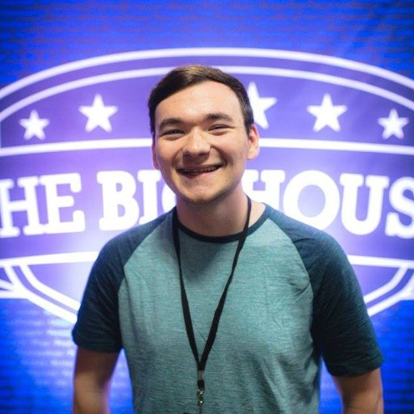

###### Of the many topics smashers regularly debate about, talent vs skill is the one that pisses me off the most.
It happens every few months. Some high level player makes the claim that talent is this immutable thing that some people have and some people don't and that's it. You'll reach your physical limit of smash brothers and will never get even better. This is bullshit and I think a lot of the things people say about it are just excuses.

##### __Innate talent isn't why you're going 2-2 at every weekly.__

Not seeing work pay off sucks and it's easy to see why people blame that on things that are out of their control. Reaction time, intelligence, and just god-given video game skill are all things I've heard people list as reasons for why they will never improve beyond where they currently are. I could spend some time [breaking down why genetic reaction speed doesn't really apply to smash](https://www.youtube.com/watch?v=cyaSRrZrPwY) and could also break down the other two, but I think the best combatant to this argument is Captain Faceroll.

There was a while where Captain Faceroll, to put it lightly, sucked.

It definitely feels like that sometimes. Stagnation in a fighting game is incredibly common and Smash is no different. You can play the game for years, grinding every day against good players and playing serious friendlies for hours and have 0 improvement in your results. It sucks. It grinds people up and spits them out. Almost every smasher feels stagnation at some point and this even includes top players like Axe. [In an interview at the first Smash Summit back in 2015](https://youtu.be/pIC5GZira0k?t=420) Axe, ranked 9th in the world, spoke about this exact issue and I think he said it very well:
> Everybody that's here now... that has played smash competitively has probably hit this point where you're playing melee, you're doing really well, and then there comes this long stretch of time where you just feel like you're not improving, no matter what you do. For me it was my pikachu, I just kept losing a lot to my friends down in my hometown and even with secondaries I just felt like I was not improving.

I recommend watching the full interview. Wife and Axe are both great. Axe continues, mentioning that his way of breaking through it was continuing to play. I think the alternative (playing less or even quitting) obviously will slow your growth or even stop it entirely, but it isn't the only thing that needs to happen in order to actually improve. I don't think that's all you can do though. This post has gotten out of hand already and beating stagnation is a whole different beast. I'll be talking more about this in part 2.

### There are clear examples of people improving over time in both smash melee and smash ultimate. Especially melee which relies more heavily on reactions
### You can't practice the same way you always have been and expect your rate of improvement to change.
### What works for some people doesn't work for others and that needs to be considered here.
### If you're willing to sweat over your process you're going to improve a lot quicker than everyone else.

