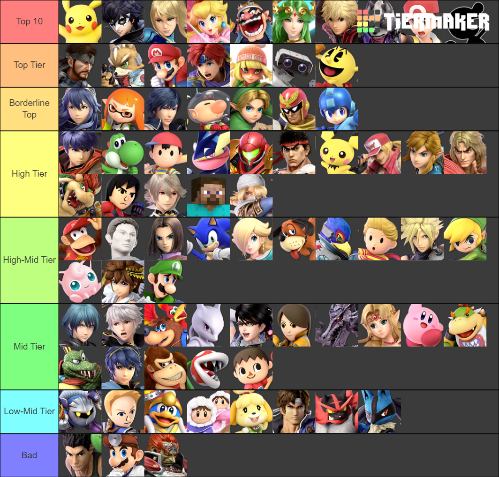

It's here folks, patch 11 has added some of the biggest changes since the release of ultimate, leaving the top of the tier list wide open. Let's take a look at the major changes and talk about where that moves the characters on the tier list.

# I HIGHLY RECOMMEND READING THE OFFICIAL PATCH NOTES [-->](https://en-americas-support.nintendo.com/app/answers/detail/a_id/54794/~/super-smash-bros.-ultimate-update-ver.-11.0.0---fighter-adjustments)

### Beefy smash doods overview: `youtube:https://www.youtube.com/embed/lLa_9-JIU9k`

## THE DEVS KNOW WHAT THEY'RE DOING
I have to hand it to them. Out of every fighting game these people might be doing the best job at creating a fun to play, balanced, competitive game, which is insanely difficult. Outside of a few changes (that we'll talk about at the end of this article) the adjustments that the team has been making for the last year have been looking great. Assuming Pyra/Mythra isn't broken this game will have successfully avoided the design issues that plagued smash four, leaving this game headed in the right direction. With offline likely to return in some form this year and the upcoming smash world tour, competitive Ultimate's future is once again looking bright.

For reference, I'll be going off of the last accurate tier list, ESAM's patch 9.0 tier list, which aired just before the release of sephiroth.
### Esam's Tier List:

# BIGGEST LOSERS
## --- Wario
Wario haters rejoice, this patch is for you.